<!-- markdownlint-disable MD033 MD041 -->

  

  

<h1 align="center" justify-items='middle'>
  Hi, I'm Lenny
  
  <!--  -->
</h1>

<!-- ### :man_technologist: About Me

I am a Full Stack Developer  from New Zealand. -->

<!-- - :telescope: I’m working on a project called **[Project Name]** and learning so much!
- :seedling: I’m currently learning everything about **[Technology]**
- :zap: In my free time, I enjoy [Your Hobby].
- :mailbox: How to reach me:  -->

<!-- --- -->

  

    
<strong>Languages</strong>

    
    
    
    
    
    
    
  

  

    
<strong>Frameworks</strong>

    
    
    
    <!--  -->
  

  

    
<strong>Backend</strong>

    
    
    
  

  

    
<strong>IoT & Machine Learning</strong>

    
    
    
    
  

  

    
<strong>DevOps & Tools</strong>

    
    
    
    
  

---

<!-- ### :fire: My Stats -->

  

  <!--  -->

  <!--  -->

  <!--  -->

  

<picture>
  <source media="(prefers-color-scheme: dark)" srcset="https://raw.githubusercontent.com/maurodesouza/maurodesouza/output/pacman-contribution-graph-dark.svg">
  <source media="(prefers-color-scheme: light)" srcset="https://raw.githubusercontent.com/maurodesouza/maurodesouza/output/pacman-contribution-graph.svg">
  
</picture>

---
